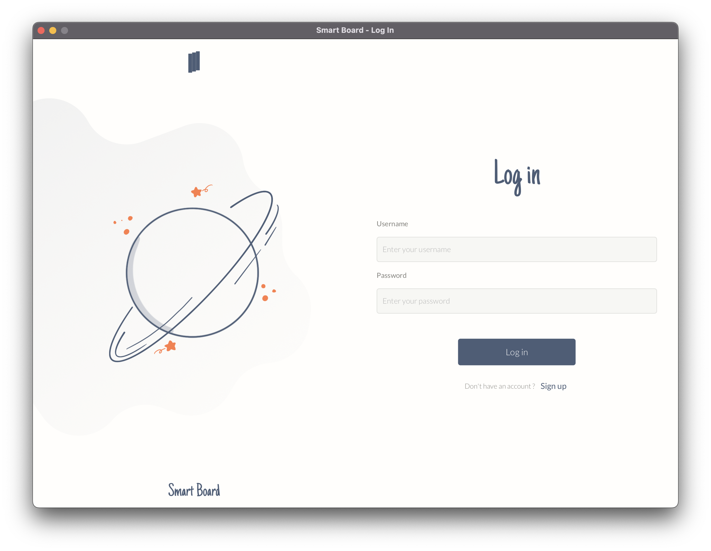
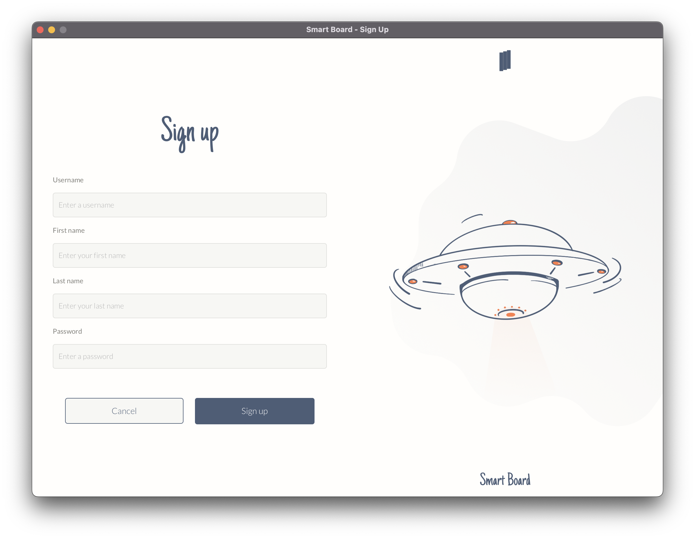
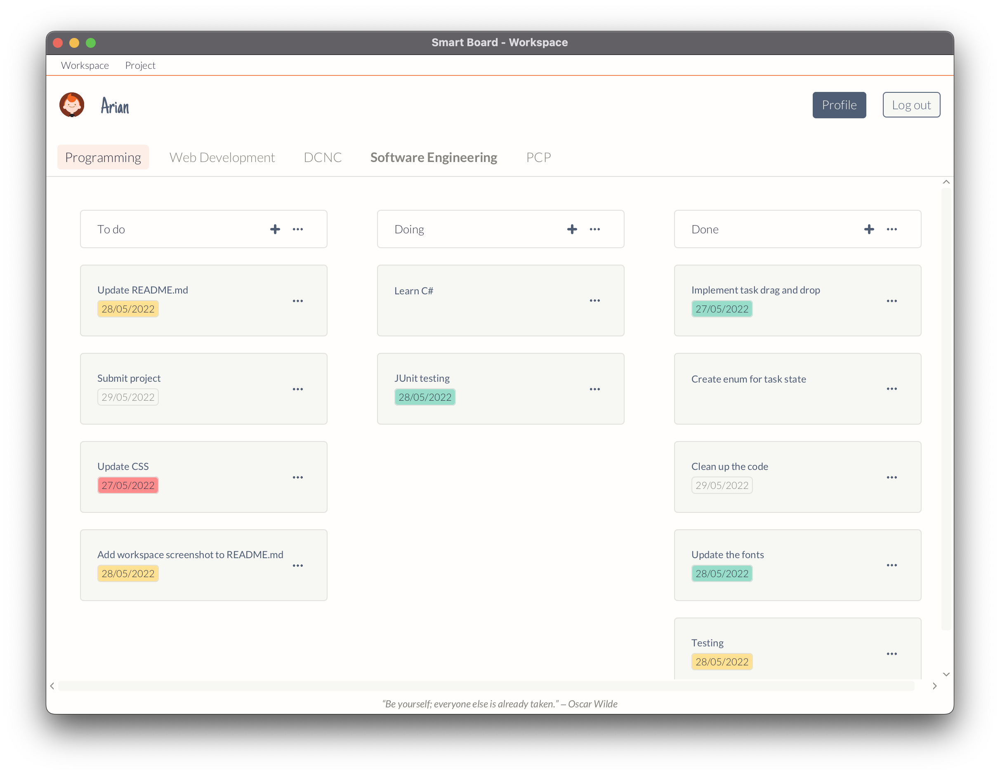
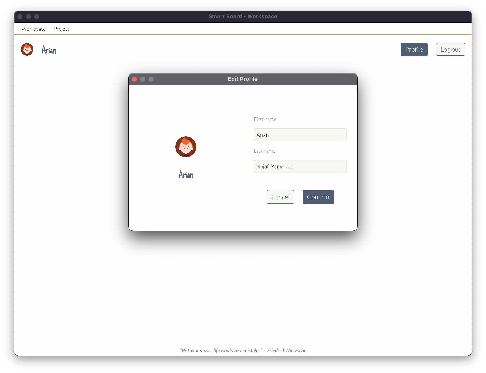

# Smart-Board
Smart Board is a desktop-based Kanban-style application for managing personal work.

- Java version 17.0.2
- Maven version 3.8.1

## To run the application

**1.1** Using the command prompt, navigate to:

```
Smart-Board 
```

**1.2** Run the following command:

```
mvn javafx:run
```

**Alternatively, import the project to [IntelliJ IDEA](https://www.jetbrains.com/idea/download/?fromIDE=#section=mac) and run the program from the IDE.**

## Screen Shots

**Log in** view screenshot


**Sign up** view screenshot


**Workspace** view screenshot


**Edit profile** view screenshot


## References

A.b, 2022. close fxml window by code, javafx. [online] Stack Overflow. Available at: <https://stackoverflow.com/questions/13567019/close-fxml-window-by-code-javafx> [Accessed 13 April 2022].

Alves, N., 2022. How to get the current opened stage in JavaFX?. [online] Stack Overflow. Available at: <https://stackoverflow.com/questions/32922424/how-to-get-the-current-opened-stage-in-javafx> [Accessed 27 April 2022].

Andrew1234, 2022. JavaFX | Background Class - GeeksforGeeks. [online] GeeksforGeeks. Available at: <https://www.geeksforgeeks.org/javafx-background-class/> [Accessed 5 May 2022].

Assylias, 2022. How to set padding between columns of a JavaFX GridPane?. [online] Stack Overflow. Available at: <https://stackoverflow.com/questions/20454021/how-to-set-padding-between-columns-of-a-javafx-gridpane> [Accessed 5 May 2022].

Baeldung, 2022. Object Type Casting in Java. [online] Baeldung. Available at: <https://www.baeldung.com/java-type-casting> [Accessed 27 April 2022].

Barosanuemailtest, 2022. Abstract controller and dependencies · barosanuemailtest/JavaFxEmailClientCourse@968af11. [online] GitHub. Available at: <https://github.com/barosanuemailtest/JavaFxEmailClientCourse/commit/968af113fc73cc16454d26ab95db0fa5962b7a34> [Accessed 11 May 2022].

Barosanuemailtest, 2022. Dynamic css · barosanuemailtest/JavaFxEmailClientCourse@695286c. [online] GitHub. Available at: <https://github.com/barosanuemailtest/JavaFxEmailClientCourse/commit/695286c30a82dd7acfa718303d31b3a65301812b> [Accessed 27 May 2022].

Biy, U., 2022. How do I add margin to a JavaFX element using CSS?. [online] Stack Overflow. Available at: <https://stackoverflow.com/questions/16977100/how-do-i-add-margin-to-a-javafx-element-using-css> [Accessed 11 May 2022].

Biy, U., 2022. How to find an element with an ID in JavaFX?. [online] Stack Overflow. Available at: <https://stackoverflow.com/questions/12201712/how-to-find-an-element-with-an-id-in-javafx> [Accessed 27 May 2022].

Biy, U., 2022. How to set tab name size in JavaFX. [online] Stack Overflow. Available at: <https://stackoverflow.com/questions/16922138/how-to-set-tab-name-size-in-javafx> [Accessed 5 May 2022].

Biy, U., 2022. JavaFX : Highlight VBox on mouse click and change color when unfocused. [online] Stack Overflow. Available at: <https://stackoverflow.com/questions/33840436/javafx-highlight-vbox-on-mouse-click-and-change-color-when-unfocused> [Accessed 5 May 2022].

Biy, U., 2022. JavaFX dynamically add buttons. [online] Stack Overflow. Available at: <https://stackoverflow.com/questions/25930944/javafx-dynamically-add-buttons> [Accessed 22 May 2022].

Biy, U., 2022. Remove arrow on JavaFX menuButton. [online] Stack Overflow. Available at: <https://stackoverflow.com/questions/30210117/remove-arrow-on-javafx-menubutton> [Accessed 22 May 2022].

Brian, 2022. How to get the selected Tab from the TabPane with JavaFX?. [online] Stack Overflow. Available at: <https://stackoverflow.com/questions/30276935/how-to-get-the-selected-tab-from-the-tabpane-with-javafx> [Accessed 5 May 2022].

Bucky, 2022. JavaFX Java GUI Tutorial. [online] Youtube.com. Available at: <https://www.youtube.com/watch?v=FLkOX4Eez6o&t=14s> [Accessed 13 April 2022].

Chappell, G. and Hildebrandt, N., 2022. Getting Started with JavaFX: Using FXML to Create a User Interface | JavaFX 2 Tutorials and Documentation. [online] Docs.oracle.com. Available at: <https://docs.oracle.com/javafx/2/get_started/fxml_tutorial.htm> [Accessed 3 April 2022].

Colorhunt.co. 2022. Light Color Palettes - Color Hunt. [online] Available at: <https://colorhunt.co/palettes/light> [Accessed 27 May 2022].

Diwan, A., 2022. Connecting to a MySQL database with Java. [online] Tutorialspoint.com. Available at: <https://www.tutorialspoint.com/connecting-to-a-mysql-database-with-java> [Accessed 11 April 2022].

Docs.oracle.com. 2022. 8 PaperDoll Drag-and-Drop Application (Release 8). [online] Available at: <https://docs.oracle.com/javase/8/javafx/events-tutorial/paper-doll.htm#CBHFHJID> [Accessed 27 May 2022].

Docs.oracle.com. 2022. F Paper Doll Drag-and-Drop Sample (Release 8). [online] Available at: <https://docs.oracle.com/javase/8/javafx/events-tutorial/paperdolljava.htm#BGBICFDH> [Accessed 27 May 2022].

DVarga and Brucker, P., 2022. JavaFX ScrollPane styling. [online] Stack Overflow. Available at: <https://stackoverflow.com/questions/41804373/javafx-scrollpane-styling> [Accessed 11 May 2022].

Eder, L., 2022. Easiest way to convert a Blob into a byte array. [online] Stack Overflow. Available at: <https://stackoverflow.com/questions/6662432/easiest-way-to-convert-a-blob-into-a-byte-array> [Accessed 27 April 2022].

Eldursi, S. and Halim, B., 2022. Styling javafx checkbox. [online] Stack Overflow. Available at: <https://stackoverflow.com/questions/43566587/styling-javafx-checkbox> [Accessed 28 May 2022].

Fabian and Sethi, H., 2022. [Solved] How to determine if the user clicked outside a particular JavaFX node? - Local Coder. [online] Localcoder.org. Available at: <https://localcoder.org/how-to-determine-if-the-user-clicked-outside-a-particular-javafx-node> [Accessed 22 May 2022].

Fadatare, R., 2022. Login Form Using JavaFX with MySQL Database. [online] Javaguides.net. Available at: <https://www.javaguides.net/2019/07/login-form-using-javafx-with-mysql-database.html> [Accessed 11 April 2022].

Fedortsova, I., 2022. Drag-and-Drop Feature in JavaFX Applications | JavaFX 2 Tutorials and Documentation. [online] Docs.oracle.com. Available at: <https://docs.oracle.com/javafx/2/drag_drop/jfxpub-drag_drop.htm> [Accessed 27 May 2022].

Figma. 2022. Figma: the collaborative interface design tool.. [online] Available at: <https://www.figma.com/> [Accessed 15 April 2022].

Frisch, E., 2022. How do you determine if an insert or update was successful using Java and MySQL?. [online] Stack Overflow. Available at: <https://stackoverflow.com/questions/24378270/how-do-you-determine-if-an-insert-or-update-was-successful-using-java-and-mysql> [Accessed 15 April 2022].

GitHub. 2022. GitHub - xerial/sqlite-jdbc: SQLite JDBC Driver. [online] Available at: <https://github.com/xerial/sqlite-jdbc> [Accessed 15 April 2022].

Goodreads.com. 2022. Inspirational Quotes (65374 quotes). [online] Available at: <https://www.goodreads.com/quotes/tag/inspirational?page=2> [Accessed 14 April 2022].

Google Fonts. 2022. Google Fonts. [online] Available at: <https://fonts.google.com/> [Accessed 3 April 2022].

Gordon, J. and Kouznetsov, A., 2022. Skinning JavaFX Applications with CSS | JavaFX 2 Tutorials and Documentation. [online] Docs.oracle.com. Available at: <https://docs.oracle.com/javafx/2/css_tutorial/jfxpub-css_tutorial.htm> [Accessed 3 April 2022].

GOXR3PLUS, 2022. JavaFx: how make a clickable image using scenebuilder. [online] Stack Overflow. Available at: <https://stackoverflow.com/questions/40495658/javafx-how-make-a-clickable-image-using-scenebuilder> [Accessed 27 April 2022].

Graham and Fabian, 2022. How to add css to a JavaFx element. [online] Stack Overflow. Available at: <https://stackoverflow.com/questions/41642403/how-to-add-css-to-a-javafx-element> [Accessed 11 May 2022].

Grinev, S., 2022. How can I get a Button's text in JavaFX if the Button is being read as a Node? Looping through Group/VBox of Buttons. Returns it as Nodes. [online] Stack Overflow. Available at: <https://stackoverflow.com/questions/9816568/how-can-i-get-a-buttons-text-in-javafx-if-the-button-is-being-read-as-a-node-l#9835566> [Accessed 22 May 2022].

Gupta, L., 2022. How to serialize and deserialize ArrayList in Java - HowToDoInJava. [online] HowToDoInJava. Available at: <https://howtodoinjava.com/java/collections/arraylist/serialize-deserialize-arraylist/> [Accessed 24 May 2022].

Halim, B., 2022. How to get Text from fxml TextField. [online] Stack Overflow. Available at: <https://stackoverflow.com/questions/41683209/how-to-get-text-from-fxml-textfield> [Accessed 11 April 2022].

Horea, A., 2022. Advanced Java programming with JavaFx: Write an email client. [online] udemy.com. Available at: <https://www.udemy.com/course/advanced-programming-with-javafx-build-an-email-client/> [Accessed 11 May 2022].

Hotzst, Ryzhikov, E. and MrEbbinghaus, 2022. How to switch scenes in JavaFX. [online] Stack Overflow. Available at: <https://stackoverflow.com/questions/37200845/how-to-switch-scenes-in-javafx> [Accessed 11 April 2022].

ItachiUchiha, 2022. How to close and iconify a JavaFx stage. [online] Stack Overflow. Available at: <https://stackoverflow.com/questions/22192484/how-to-close-and-iconify-a-javafx-stage> [Accessed 28 April 2022].

James_D and Sevle, 2022. How do I resize an imageview image in javafx?. [online] Stack Overflow. Available at: <https://stackoverflow.com/questions/27894945/how-do-i-resize-an-imageview-image-in-javafx> [Accessed 22 May 2022].

James_D, 2022. JavaFX DatePicker getValue in a specific format. [online] Stack Overflow. Available at: <https://stackoverflow.com/questions/26831978/javafx-datepicker-getvalue-in-a-specific-format> [Accessed 24 May 2022].

James_D, 2022. JavaFX How to get a children (WebView) from a Tab?. [online] Stack Overflow. Available at: <https://stackoverflow.com/questions/28173252/javafx-how-to-get-a-children-webview-from-a-tab> [Accessed 5 May 2022].

Java2s.com. 2022. JavaFX How to - Add two controls to HBox. [online] Available at: <http://www.java2s.com/Tutorials/Java/JavaFX_How_to/HBox/Add_two_controls_to_HBox.htm> [Accessed 5 May 2022].

Java2s.com. 2022. JavaFX How to - Handle Shape drag and drop events. [online] Available at: <http://www.java2s.com/Tutorials/Java/JavaFX_How_to/Shape/Handle_Shape_drag_and_drop_events.htm> [Accessed 27 May 2022].

Jenkov, J., 2022. JavaFX CheckBox. [online] Jenkov.com. Available at: <https://jenkov.com/tutorials/javafx/checkbox.html> [Accessed 24 May 2022].

Jenkov, J., 2022. JavaFX DatePicker. [online] Jenkov.com. Available at: <https://jenkov.com/tutorials/javafx/datepicker.html> [Accessed 24 May 2022].

Jenkov, J., 2022. JavaFX MenuButton. [online] Jenkov.com. Available at: <https://jenkov.com/tutorials/javafx/menubutton.html> [Accessed 22 May 2022].

Jenkov, J., 2022. JavaFX TabPane. [online] Jenkov.com. Available at: <https://jenkov.com/tutorials/javafx/tabpane.html> [Accessed 27 April 2022].

Jetbrains.com. 2022. IntelliJ IDEA Ultimate – the IDE for Spring development. [online] Available at: <https://www.jetbrains.com/lp/intellij-frameworks/> [Accessed 3 April 2022].

Jewelsea and Tonkel, 2022. JavaFX: setHgrow(...) doesn't work. [online] Stack Overflow. Available at: <https://stackoverflow.com/questions/21865044/javafx-sethgrow-doesnt-work> [Accessed 11 May 2022].

Jewelsea, 2022. JavaFX, finding node by Id. [online] Stack Overflow. Available at: <https://stackoverflow.com/questions/68475291/javafx-finding-node-by-id> [Accessed 27 May 2022].

Kaltstahl, Z., 2022. JavaFx USE_COMPUTED_SIZE for Stage without using FXML. [online] Stack Overflow. Available at: <https://stackoverflow.com/questions/28573700/javafx-use-computed-size-for-stage-without-using-fxml> [Accessed 5 May 2022].

Kapoor, V., 2022. [online] Foxinfotech.in. Available at: <https://www.foxinfotech.in/2019/12/github-markdown-add-an-image-to-readme-md-file.html> [Accessed 12 May 2022].

Kasim, R., 2022. Is is possible to make a method execute only once?. [online] Stack Overflow. Available at: <https://stackoverflow.com/questions/2665993/is-is-possible-to-make-a-method-execute-only-once> [Accessed 27 May 2022].

Kiers, B., 2022. How to find the index of an element in an array in Java?. [online] Stack Overflow. Available at: <https://stackoverflow.com/questions/1522108/how-to-find-the-index-of-an-element-in-an-array-in-java> [Accessed 11 May 2022].

Kleopatra, 2022. JavaFX TextArea style with css. [online] Stack Overflow. Available at: <https://stackoverflow.com/questions/51594560/javafx-textarea-style-with-css> [Accessed 22 May 2022].

Knowprogram. 2022. isBlank() vs isEmpty() in Java String. [online] Available at: <https://www.knowprogram.com/java/isblank-vs-isempty-in-java/> [Accessed 5 May 2022].

Kozlova, A., 2022. Support for JavaFX 2 CSS in IntelliJ IDEA 12.1 | The IntelliJ IDEA Blog. [online] The JetBrains Blog. Available at: <https://blog.jetbrains.com/idea/2013/03/support-for-javafx-2-css-in-intellij-idea-121/> [Accessed 3 April 2022].

Krishna, M., 2022. How to add an image to a button (action) in JavaFX?. [online] Tutorialspoint.com. Available at: <https://www.tutorialspoint.com/how-to-add-an-image-to-a-button-action-in-javafx> [Accessed 5 May 2022].

L. Saito, T., 2022. Inserting BLOBs. [online] Groups.google.com. Available at: <https://groups.google.com/g/xerial/c/FfNOo-dPlsE?hl=en#efd9bcd10d194672> [Accessed 27 April 2022].

Lucidchart. 2022. Intelligent Diagramming | Lucidchart. [online] Available at: <https://www.lucidchart.com/pages/> [Accessed 15 April 2022].

MadProgrammer, 2022. retrieving value from database in java. [online] Stack Overflow. Available at: <https://stackoverflow.com/questions/12773076/retrieving-value-from-database-in-java> [Accessed 14 April 2022].

Mandliya, A., 2022. java random number between 1 and 10 - Java2Blog. [online] Java2Blog. Available at: <https://java2blog.com/java-random-number-1-10/> [Accessed 14 April 2022].

MavenLibs.com. 2022. org.xerial : sqlite-jdbc - Maven Repository [Java]. [online] Available at: <https://mavenlibs.com/maven/dependency/org.xerial/sqlite-jdbc> [Accessed 15 April 2022].

Mevada, R., 2022. How can I style a JavaFX menu and its items in CSS?. [online] Stack Overflow. Available at: <https://stackoverflow.com/questions/21912946/how-can-i-style-a-javafx-menu-and-its-items-in-css?noredirect=1&lq=1> [Accessed 14 April 2022].

Mrak, 2022. How to extend custom JavaFX components that use FXML. [online] Stack Overflow. Available at: <https://stackoverflow.com/questions/31569299/how-to-extend-custom-javafx-components-that-use-fxml> [Accessed 24 May 2022].

Nerád, Ľ. and Gordon, J., 2022. Handling JavaFX Events: Working with Event Filters | JavaFX 2 Tutorials and Documentation. [online] Docs.oracle.com. Available at: <https://docs.oracle.com/javafx/2/events/filters.htm> [Accessed 27 May 2022].

Pankaj, 2022. Java SQL Blob - JournalDev. [online] JournalDev. Available at: <https://www.journaldev.com/44618/java-sql-blob> [Accessed 27 April 2022].

Parashar, A., 2022. How to change the tab pane style. [online] Stack Overflow. Available at: <https://stackoverflow.com/questions/17091605/how-to-change-the-tab-pane-style> [Accessed 11 May 2022].

Parashar, A., 2022. set background color in scrollpane. [online] Stack Overflow. Available at: <https://stackoverflow.com/questions/20118574/set-background-color-in-scrollpane> [Accessed 11 May 2022].

Pedamkar, P., 2022. SQL DELETE Row | How to Implement SQL DELETE ROW | Examples. [online] EDUCBA. Available at: <https://www.educba.com/sql-delete-row/> [Accessed 24 May 2022].

Pereda, J., 2022. In javafx, how to change scrollbar arrow color?. [online] Stack Overflow. Available at: <https://stackoverflow.com/questions/42808539/in-javafx-how-to-change-scrollbar-arrow-color> [Accessed 11 May 2022].

Pethani, A., 2022. Switching between Scenes (Screens) in JavaFx using the FXML. [online] Gist. Available at: <https://gist.github.com/pethaniakshay/302072fda98098a24ce382a361bdf477> [Accessed 11 April 2022].

Pomarolli, A., 2022. JavaFX Drag and Drop Example. [online] Examples Java Code Geeks. Available at: <https://examples.javacodegeeks.com/desktop-java/javafx/event-javafx/javafx-drag-drop-example/> [Accessed 27 May 2022].

Pratt, E. and mh-dev, 2022. How do I add margin to a JavaFX element using CSS?. [online] Stack Overflow. Available at: <https://stackoverflow.com/questions/16977100/how-do-i-add-margin-to-a-javafx-element-using-css> [Accessed 24 May 2022].

Pratyaksa, D., 2022. javafx-mvc/Person.java at main · dipto-pratyaksa-rmit/javafx-mvc. [online] GitHub. Available at: <https://github.com/dipto-pratyaksa-rmit/javafx-mvc/blob/main/src/main/java/com/javafx/mvc/model/Person.java> [Accessed 11 May 2022].

Prometheus, 2022. Remove the glowing border from focused tab with CSS. [online] Stack Overflow. Available at: <https://stackoverflow.com/questions/34211310/remove-the-glowing-border-from-focused-tab-with-css> [Accessed 11 May 2022].

Reddy, A., 2022. Create a new database with MySQL Workbench?. [online] Tutorialspoint.com. Available at: <https://www.tutorialspoint.com/create-a-new-database-with-mysql-workbench> [Accessed 11 April 2022].

Rmit.instructure.com. 2022. Further Programming. [online] Available at: <https://rmit.instructure.com/courses/96668> [Accessed 27 April 2022].

Ruzicka, V., 2022. JavaFX Tutorial: CSS Styling. [online] Vojtech Ruzicka's Programming Blog. Available at: <https://www.vojtechruzicka.com/javafx-css/> [Accessed 3 April 2022].

Saif, S., 2022. [online] Saif71.com. Available at: <https://saif71.com> [Accessed 12 May 2022].

Schoen, J., 2022. How do you set the style for a JavaFX ContextMenu using css?. [online] Stack Overflow. Available at: <https://stackoverflow.com/questions/11127999/how-do-you-set-the-style-for-a-javafx-contextmenu-using-css> [Accessed 24 May 2022].

Slaw, 2022. Can I only target bottom border at JavaFX Styling?. [online] Stack Overflow. Available at: <https://stackoverflow.com/questions/60682935/can-i-only-target-bottom-border-at-javafx-styling> [Accessed 14 April 2022].

Snortum, K., 2022. javafx-pass-data-demo/src/main/java/net/snortum/passdatademo at master · ksnortum/javafx-pass-data-demo. [online] GitHub. Available at: <https://github.com/ksnortum/javafx-pass-data-demo/tree/master/src/main/java/net/snortum/passdatademo> [Accessed 27 April 2022].

Sonawalla, A. and Nat, 2022. Remove border around JavaFX ScrollPane scroll bar when *not* focused. [online] Stack Overflow. Available at: <https://stackoverflow.com/questions/50184756/remove-border-around-javafx-scrollpane-scroll-bar-when-not-focused> [Accessed 11 May 2022].

Sourcecodeexamples.net. 2022. JavaFX JDBC MySQL Database Example. [online] Available at: <https://www.sourcecodeexamples.net/2020/04/javafx-jdbc-mysql-database-example.html> [Accessed 11 April 2022].

SQLite Tutorial. 2022. SQLite DELETE Statement Step By Step with Examples. [online] Available at: <https://www.sqlitetutorial.net/sqlite-delete/> [Accessed 24 May 2022].

SQLite Tutorial. 2022. SQLite Java: Inserting Data. [online] Available at: <https://www.sqlitetutorial.net/sqlite-java/insert/> [Accessed 15 April 2022].

Squarespace Help Center. 2022. Markdown cheat sheet. [online] Available at: <https://support.squarespace.com/hc/en-us/articles/206543587-Markdown-cheat-sheet> [Accessed 12 May 2022].

Svarog, 2022. Creating Map composed of 2 Lists using stream().collect in Java. [online] Stack Overflow. Available at: <https://stackoverflow.com/questions/39962796/creating-map-composed-of-2-lists-using-stream-collect-in-java> [Accessed 11 May 2022].

Syed, A., selvarajah, a., Naeem, A. and Guo, Y., 2022. Kanban-Board/src/main/java/project at master · adwansyed/Kanban-Board. [online] GitHub. Available at: <https://github.com/adwansyed/Kanban-Board/tree/master/src/main/java/project> [Accessed 11 May 2022].

Turri, A. and Ry-, 2022. Specifying external font in JavaFX CSS. [online] Stack Overflow. Available at: <https://stackoverflow.com/questions/12173288/specifying-external-font-in-javafx-css> [Accessed 3 April 2022].

Tutorialspoint.com. 2022. SQLite - UPDATE Query. [online] Available at: <https://www.tutorialspoint.com/sqlite/sqlite_update_query.htm> [Accessed 27 April 2022].

WEGSY85, 2022. JavaFX Image from resources folder. [online] Stack Overflow. Available at: <https://stackoverflow.com/questions/59029879/javafx-image-from-resources-folder> [Accessed 5 May 2022].

W3schools.com. 2022. Java LinkedList. [online] Available at: <https://www.w3schools.com/java/java_linkedlist.asp> [Accessed 27 April 2022].

www.javatpoint.com. 2022. Factory Method Design Pattern - Javatpoint. [online] Available at: <https://www.javatpoint.com/factory-method-design-pattern> [Accessed 27 April 2022].

www.javatpoint.com. 2022. How to Compare Dates in Java - Javatpoint. [online] Available at: <https://www.javatpoint.com/how-to-compare-dates-in-java> [Accessed 27 May 2022].

Zephyr, 2022. JavaFx property binding with multiple objects on on screen. [online] Stack Overflow. Available at: <https://stackoverflow.com/questions/53771119/javafx-property-binding-with-multiple-objects-on-on-screen> [Accessed 5 May 2022].

Zephyr, 2022. Java FX Set Margin. [online] Stack Overflow. Available at: <https://stackoverflow.com/questions/51574433/java-fx-set-margin> [Accessed 5 May 2022].

Zon and kbyrd, 2022. Get key from a HashMap using the value. [online] Stack Overflow. Available at: <https://stackoverflow.com/questions/8112975/get-key-from-a-hashmap-using-the-value> [Accessed 24 May 2022].

Zon, 2022. JavaFX TabPane: How to set the selected tab. [online] Stack Overflow. Available at: <https://stackoverflow.com/questions/6902377/javafx-tabpane-how-to-set-the-selected-tab> [Accessed 5 May 2022].